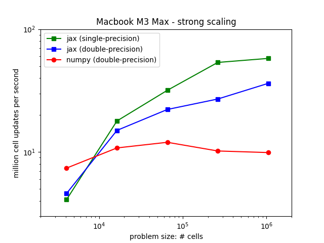
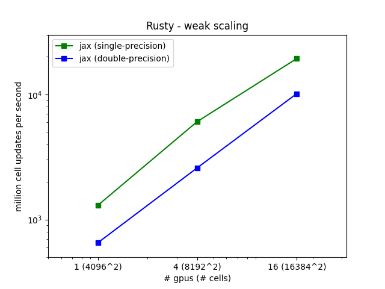

# Simple Euler Equation JAX benchmarking

Philip Mocz (2024)

Flatiron Institute

Benchmarking on `macbook` (Apple M3 Max) and `rusty` (Nvidia A100)

## Files

* `euler.py` simple JAX version on single node
* `euler_distributed.py` JAX version for distributed systems
* `euler_numpy.py` simple numpy version (based on my [blog tutorial](https://levelup.gitconnected.com/create-your-own-finite-volume-fluid-simulation-with-python-8f9eab0b8305?sk=584a56a12a551ca1b74ba19b2a9dffbb))

## Strong Scaling on `macbook`:

## Weak Scaling on `rusty`:

## Final Simulation Result

16384^2 resolution JAX (single-precision) simulation after 277300 iterations on 16 GPUs in 64.1 minutes

(for reference, my macbook run (single-precision) at 1024^2 resolution after 15426 iterations took 4.6 minutes)

The GPU calculations had a throughput (mcups) 335x more!

