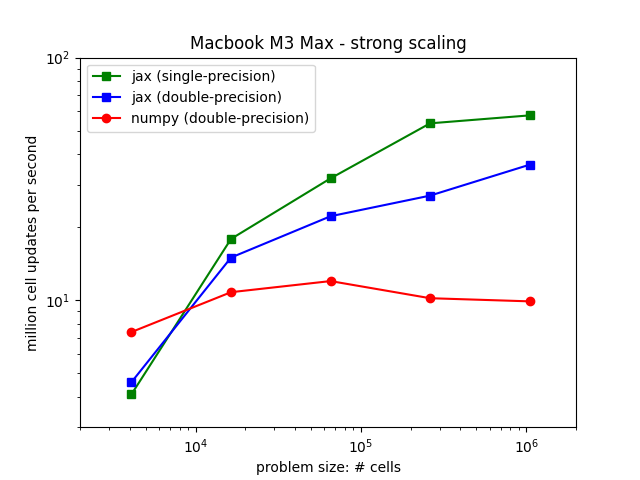
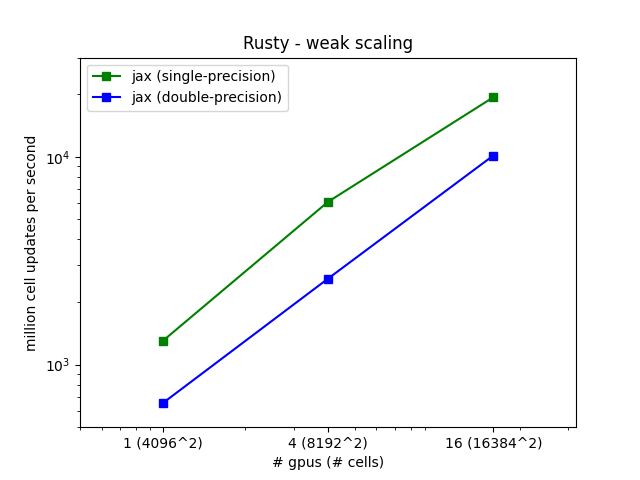

# Simple Euler Equation JAX benchmarking

Philip Mocz (2024)

Flatiron Institute

Benchmarking on `macbook` (Apple M3 Max) and `rusty` (Nvidia A100)

## Strong Scaling on `macbook`:

## Weak Scaling on `rusty`:

## Final Simulation Result

8192^2 resolution JAX (single-precision) simulation after 137145 iterations on 8 GPUs in 17.6 minutes

(for reference, my macbook run at 1024^2 resolution after 15424 iterations took 7.4 minutes)

The GPU calculations had a throughput (mups) 240x more!

